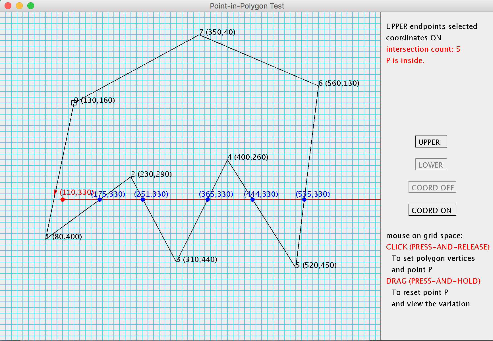

# 2017 Summer Computer Graphics CS6366
Instructor: **Dr. ZHANG Kang**

This course focuses on different coordinate systems and their transformations, the algorithms for basic 2D and 3D drawings, etc.

## What's inside the folder
- `PointPoly.java` is the deliverable source code for Assignment 3.

- `ass3_17Su.txt` is the requirement of Assignment 3.

- `pointtester.png` is the snapshot of the user interface.

## Assignment 3: Point-in-Polygon Tester
Java / Desktop Application

The program is an implementation of the principle of the Point-in-polygon test algorithm (**half-line algorithm and the even-odd rule**). It tests and demonstrates if a point P is inside or outside of a polygon. Users can draw their own polygon and point.

- Every mouse click point is displayed on the nearest grid point of the grid space.

- Click on the grid space to draw a polygon. When the polygon is closed and finished, click again to get a point P to test.

- The program will draw a horizontal half-line from P to the rightmost to do the test: the intersection points of the half-line and polygon edges will be highlighted, the number of intersections as well as the test result will be displayed.
- When P is set and the intersections are displayed: if the user drags on the grid space, the program will reset point P along the cursor so that the user can observe the variation of the results during the move.

- User can choose to take upper or lower endpoints to do the test by clicking on the button.

- A coordinate display switch button is also provided.

## How to run the code
1. download `PointPoly.java`
2. in terminal or cmd, `cd` to the corresponding folder  
3. in terminal or cmd, input `javac PointPoly.java` to compile the source code  
4. in terminal or cmd, input `java PointPoly` to run the application
